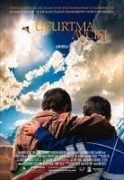

# HTML Ödev 2 - Kişisel Sayfamızı Detaylandırmaya Devam Etmek

### Bu repository'de Kodluyoruz.org ve Patika.dev işbirliğiyle, "Başlangıç Seviye Django ile Web Development Patikası" içerisinde bulunan "HTML" konusunun ikinci ödevini yaptım.

 ## **Talha Bayyar** ##

## **Hakkımda**

#### Merhalar Ahmet Talha Bayyar 23 yaşındayım Osmangazi Üniversitesi İktsat Bölümü mezunuyum ikinci üniversite olarak da Yönetim Bilişim Sistemleri 3. sınıf öğrencisiyim  yazılım ve programlama alanında kariyer hedeflerim doğrultusunda

## Hobilerim

- Sinema
- futbol oynamak
- yazılım
- doğa yürüşleri

## Film

 - Baba
 - [Esaretin Bedeli](https://www.imdb.com/title/tt0111161/?pf_rd_m=A2FGELUUNOQJNL&pf_rd_p=1a264172-ae11-42e4-8ef7-7fed1973bb8f&pf_rd_r=CVQMXKCJNAHH5NHMXKDH&pf_rd_s=center-1&pf_rd_t=15506&pf_rd_i=top&ref_=chttp_tt_1)
 - Kara Şövalye
 - 12 Öfkeli Adam
 - Schindler'in Listesi

## Dizi

- Çernobil
- [Sherlock](https://www.imdb.com/title/tt1475582/?ref_=ttls_li_tt) 
- Dark
- Taht Oyunları
- Köprü

## Sevdiğim Kitap

Uçurtma Avcısı, Afganistan doğumlu Amerikalı yazar Khaled Hosseini'nin ilk romanıdır. Kitapta dostluk, arkadaşlık, sevgi, ihanet, barış temalarına değinilmiştir. 2003 yılında yayımlanan kitap, bir Afgan tarafından İngilizce yazılmış ilk romandır

